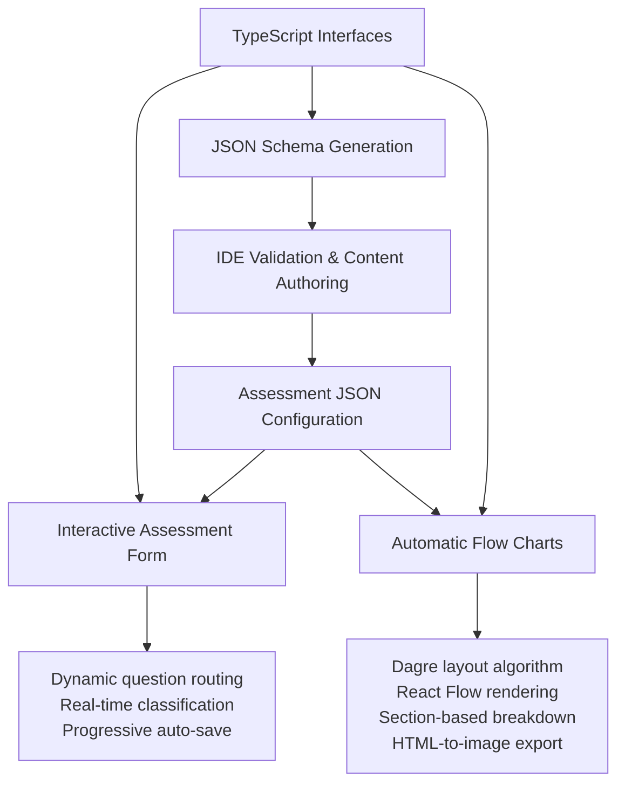

# High-Level Technical Architecture

## The Problem & Solution

Traditional assessment tools hardcode business logic, making updates slow and requiring developer involvement for content changes. This framework solves that by **separating assessment logic from code**, enabling rapid iteration and non-technical content authoring.

## Core Innovation: Dual-Source Architecture

The framework's power comes from its **dual-source architecture** where both TypeScript interfaces and JSON configuration drive the system:

- **TypeScript interfaces** provide compile-time safety and enable schema generation for content authoring
- **JSON configuration** contains the actual assessment logic and drives runtime behaviour
- **Both sources converge** at the interactive form and flow chart components, ensuring type safety with content flexibility



## Key Architectural Outcomes

### 1. Interactive Assessment Form
- **Dynamic question routing** based on user responses
- **Real-time feedback** with auto-save and progressive classification
- **Intelligent navigation** that skips irrelevant sections and provides early termination for unsuitable use cases

### 2. Automatic Flow Chart Generation
- **Dynamic visual mapping** generated directly from JSON assessment configuration
- **Section-based breakdown** using assessment sections to create digestible diagram chunks rather than overwhelming single flow charts
- **Professional rendering** with React Flow for interactive diagrams and Dagre algorithm for automatic node positioning and layout optimisation
- **Export capabilities** using html-to-image for downloadable flow charts that stakeholders can share and include in documentation
- **Complete audit trail** showing exactly how recommendations are determined for any given user path

### 3. Content-Code Separation
- **Non-technical content authoring** through JSON editing with schema validation
- **Rapid iteration** on assessment criteria without code deployment
- **Version control** for assessment logic separate from application code

## Technical Implementation Strategy

### Schema-First Development
```
TypeScript Interfaces → JSON Schema → IDE Validation → Content Authoring
```

The framework implements an automated build pipeline using `ts-json-schema-generator` that transforms TypeScript interfaces into JSON schemas:

- **Single source of truth**: Assessment structure defined once in TypeScript interfaces
- **Automated generation**: Build scripts extract type information and generate JSON Schema Draft-07 compatible schemas
- **Documentation preservation**: JSDoc comments from TypeScript interfaces become description fields in schemas, providing contextual guidance during content authoring
- **Custom enhancement**: Post-processing script adds schema identifiers and IDE optimisations
- **IDE integration**: Generated schemas provide auto-completion, validation, and inline documentation for content authors
- **Type safety bridge**: Same interfaces validate JSON configuration at runtime, ensuring consistency

This pipeline enables non-technical content authoring whilst maintaining compile-time safety and preventing configuration errors.

### State Management Philosophy
- **Progressive auto-save** eliminates user friction whilst maintaining data consistency
- **Context-driven state** with local reducers for complex question interactions
- **Real-time classification** updates as users progress through branching logic

### Frontend-Only Architecture
- **Static deployment** with no backend infrastructure requirements
- **Client-side processing** of all assessment logic and state management
- **Immediate responsiveness** without server round-trips

## Portfolio Demonstration Value

### Problem-Solving Approach
- **Identified core constraint**: Content updates requiring developer involvement
- **Designed elegant separation**: Business logic in data, not code
- **Built comprehensive solution**: From content authoring to user experience

### Technical Sophistication
- **Dual-source architecture**: TypeScript interfaces and JSON configuration converging at runtime components
- **Complete type safety pipeline**: From interface definition through schema generation to runtime validation
- **Sophisticated state management**: Real-time updates with complex branching logic and auto-save
- **Automated visual generation**: Dynamic flow charts with professional layout algorithms

### User Experience Focus
- **Intelligent routing**: Users only see relevant questions
- **Immediate feedback**: Real-time classification and progress indication
- **Visual communication**: Automatic flow charts for stakeholder alignment

### Scalability & Maintainability
- **Framework approach**: Easily extensible to new assessment types
- **Content workflow**: Non-technical users can modify and improve assessments
- **Quality assurance**: Schema validation prevents configuration errors

## Technology Stack Rationale

- **React + TypeScript**: Type safety with modern, maintainable component architecture
- **Tailwind CSS**: Rapid styling without CSS complexity
- **Vite**: Fast development and optimised production builds
- **React Flow + Dagre**: Interactive flow chart rendering with automatic layout algorithms
- **HTML-to-Image**: Export capability for stakeholder documentation and sharing

---

**Core Achievement**: Transformed a traditionally code-heavy problem into a configuration-driven solution that empowers content authors whilst maintaining technical robustness and excellent user experience.